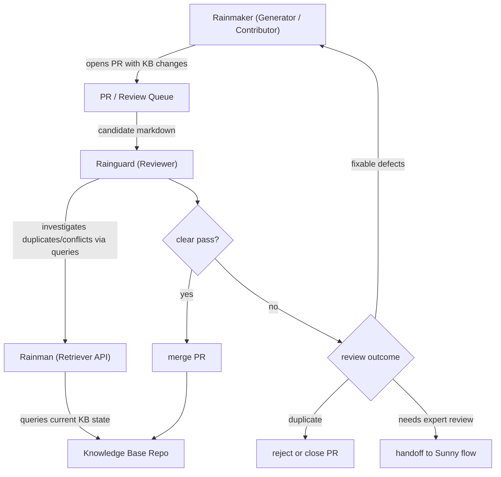
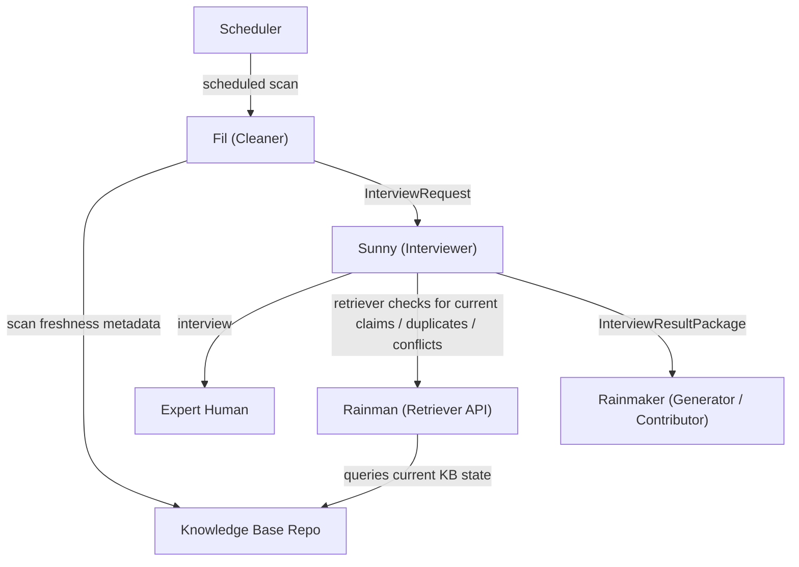

# rain agents monorepo

This repository is a monorepo for five agents:

- `agents/rainman` — knowledge expert and query agent
- `agents/rainmaker` — KB markdown generator agent
- `agents/rainguard` — KB markdown reviewer and QA agent
- `agents/sunny` — interviewer agent
- `agents/fil` — cleaner agent

Agent-specific documentation is kept with each agent's source tree.
A shared KB markdown specification lives at `docs/KBMDQA_V1_SPEC.md` and is referenced by Rainmaker and Rainguard.
For runtime use, the relevant agent images can bake the spec into `/app/specs/KBMDQA_V1_SPEC.md`.

## Layout

```text
agents/
  rainman/
  rainmaker/
  rainguard/
  sunny/
  fil/
```

## Workspace commands

Install dependencies from the repo root:

```bash
npm install
```

Common commands:

```bash
npm run build
npm run typecheck
npm run dev:rainman
```

## Agent interaction model

### Authoring and review flow



### Freshness and revalidation flow



## Agent docs

- `agents/rainman/README.md`
- `agents/rainman/DESIGN.md`
- `agents/rainman/CODEBASE.md`
- `agents/rainmaker/README.md`
- `agents/rainmaker/DESIGN.md`
- `agents/rainmaker/CODEBASE.md`
- `agents/rainguard/README.md`
- `agents/rainguard/DESIGN.md`
- `agents/rainguard/CODEBASE.md`
- `agents/sunny/README.md`
- `agents/sunny/DESIGN.md`
- `agents/sunny/CODEBASE.md`
- `agents/fil/README.md`
- `agents/fil/DESIGN.md`
- `agents/fil/CODEBASE.md`
